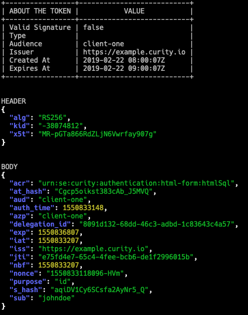

# JAWS: The JWT Swiss Army Knife



## Objective

JAWS is a command-line tool that helps you decode and inspect JWT tokens. It's like a Swiss Army knife for JWTs, giving you the power to:

👉 Decode JWT tokens and print their content in a human-readable format

👉 Validate JWT signatures using a signing key

👉 Print the header and body of a JWT token separately

## How to Use

To use JAWS, simply install it using go get and then run the jaws decode command followed by the JWT token you want to decode. For example:

```bash
$ go get github.com/pedrolopeme/jaws
$ jaws decode <JWT ENCODED TOKEN>
```

JAWS will then print the decoded JWT token to the terminal:

[](https://asciinema.org/a/XNjDhu99Lc3Nx1ifrT1JridD8)

## How to Contribute

JAWS is an open source project and we welcome contributions from the community. If you find a bug or have a feature request, please open an issue on the GitHub page. If you want to contribute code, please fork the repository and submit a pull request.

## Tests and Coverage
JAWS has a comprehensive test suite that covers its functionality. To run the tests, simply run the following command:

```bash
$ make test
```

JAWS also has a coverage report that shows how much of the code is covered by the tests. To generate the coverage report, run the following command:

```bash
$ make coverage
```

The coverage report will be generated in the coverage directory.

## Dependencies

JAWS depends on the following libraries:

* github.com/dgrijalva/jwt-go
* github.com/spf13/cobra

## Authors

JAWS was created by Pedro Mendes (@pedrolopeme).

## License

JAWS is licensed under the Apache License, Version 2.0. See the LICENSE file for more details.